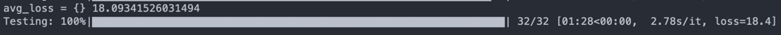

# Predicting Java methods' names with transformers
This is the test task for JetBrains Internship. 
Fine-tuning of [hugginface models](https://huggingface.co/models)
trained on subset of [Java-small](https://github.com/tech-srl/code2seq)
dataset to predict Java methods' names.

## Guide to run models

### Requirements
* `pip install transformers`
* `pip install torch`
* `pip install tqdm`
* `pip install datasets`

### Running guide
1. `git clone https://github.com/mmalofeev/TransformersMethodsNamePrediction-.git`
2. `cd TransformersMethodsNamePrediction-`
3. `wget https://s3.amazonaws.com/code2seq/datasets/java-small.tar.gz` to 
download the dataset
4. `tar -xf java-small.tar.gz` to unzip the dataset
5. `python3 codebert-base-mlm.py` to train and test [codebert-base-mlm](https://huggingface.co/microsoft/codebert-base-mlm?text=The+goal+of+life+is+%3Cmask%3E.)
6. `python3 codebert-base-mlm.py` to train and test [codeBERTa-small-v1](https://huggingface.co/huggingface/CodeBERTa-small-v1)

## Results
I was training models on 1024 methods due to low computing ability 
of my laptop.
### codebert-base-mlm
* Results of predictions before training

* Results of predictions after training

### codeberta-small-v1
* Results of predictions before training

* Results of predictions after training
