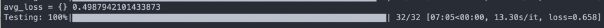

# Predicting Java methods' names with transformers
This is the test task for JetBrains Internship. 
Fine-tuning of [hugginface models](https://huggingface.co/models)
trained on subset of [Java-small](https://github.com/tech-srl/code2seq)
dataset to predict Java methods' names.

## Guide to run models

### Requirements
* `pip install transformers`
* `pip install torch`
* `pip install tqdm`
* `pip install datasets`

### Running guide
1. `git clone https://github.com/mmalofeev/TransformersMethodsNamePrediction-.git`
2. `cd TransformersMethodsNamePrediction-`
3. `wget https://s3.amazonaws.com/code2seq/datasets/java-small.tar.gz` to 
download the dataset
4. `tar -xf java-small.tar.gz` to unzip the dataset
5. `python3 codebert-base-mlm.py` to train and test [codebert-base-mlm](https://huggingface.co/microsoft/codebert-base-mlm?text=The+goal+of+life+is+%3Cmask%3E.)
6. `python3 codebert-base-mlm.py` to train and test [codeBERTa-small-v1](https://huggingface.co/huggingface/CodeBERTa-small-v1)

UPD: `python3 codebert-base-mlm.py` and `python3 codebert-base-mlm.py` can 
fail because of difference between target batch size and 
input batch size (there are some assers in `api.py` to check it).
There are some ways to get rid of assertion failures:
* uncomment 29 and 30 lines in `api.py`
* clean python cache
* run command a couple more times
* add `print("something")` to `datasets_generator.py` in the end of the file
* In case you have Java exception that there are some 
errors in settings.gradle, please uncomment 70 and 71 lines
in `parser/src/main/java/Main.java` and run Main.java in 
Intellij IDEA. 

If nothing above wouldn't help, please contact me on Telegram
[@xugfg](https://t.me/xugfg).

## Results
I was training models on 1024 methods due to low computing ability 
of my laptop. Training takes about 1.5 hours on Macbook Air M1(2020) because
transformers' self-attention layer has O(n^2) complexity 
where n is number of tokens in input text. 
### codebert-base-mlm
* Results of predictions before training

* Results of predictions after training

### codeberta-small-v1
* Results of predictions before training

* Results of predictions after training

As we can see model's fine-tuning give a lot of benefit 
and prediction results become a lot better than it was 
on pretrained model.